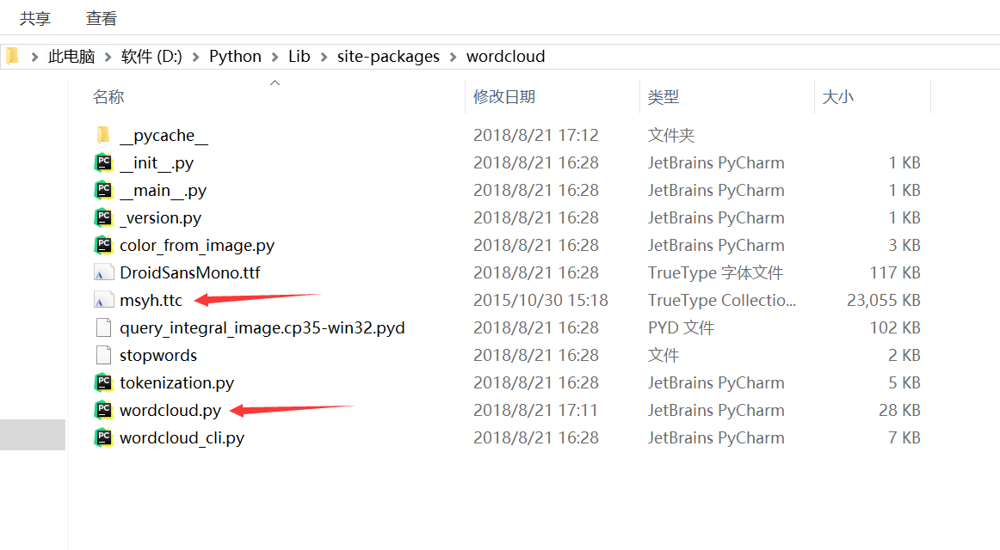

WordCloud默认是不支持中文的，所以在有中文的时候显示的就是一个方框


现在来解决这个问题:

在网上或者电脑系统盘里面(C:\Windows\Fonts)找到字体库，然后复制到WordCloud包里面去，跟WordCloud.py放同一个目录



打开wordcloud.py，第28行

```python
FILE = os.path.dirname(__file__)
FONT_PATH = os.environ.get('FONT_PATH', os.path.join(FILE, 'DroidSansMono.ttf'))
STOPWORDS = set(map(str.strip, open(os.path.join(FILE, 'stopwords')).readlines()))
```

修改默认字符集为`msyh.ttc`

```python
FONT_PATH = os.environ.get('FONT_PATH', os.path.join(FILE, 'msyh.ttc'))
```

然后再运行就没问题了