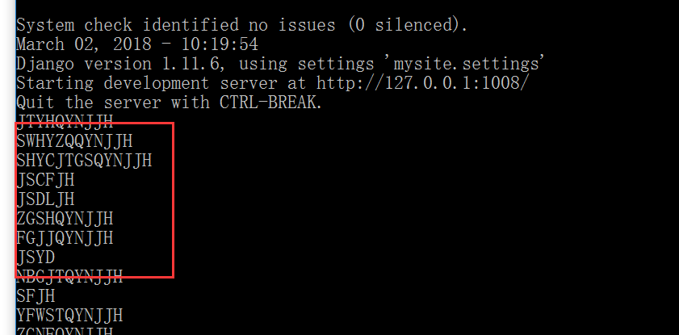

## 一、搭建django 环境

 #### 1.安装django

```
pip install django
```

安装好以后查看版本号:

```
C:\Users\HC>python
>>> import django
>>> django.get_version()
'1.11.6'
```

#### 2.创建项目

```
C:\Users\HC>e:
E:\>cd E:\练习Demo\python
E:\练习Demo\python>django-admin startproject mysite
E:\练习Demo\python>python manage.py runserver
```

默认启动的端口是8000，如果8000端口被占用了，就会报错：

```
Performing system checks...

System check identified no issues (0 silenced).

You have 13 unapplied migration(s). Your project may not work properly until you apply the migrations for app(s): admin, auth, contenttypes, sessions.
Run 'python manage.py migrate' to apply them.
March 01, 2018 - 13:47:47
Django version 1.11.6, using settings 'mysite.settings'
Starting development server at http://127.0.0.1:8000/
Quit the server with CTRL-BREAK.
Error: [WinError 10013] 以一种访问权限不允许的方式做了一个访问套接字的尝试。
```

那么 手动改一下启动的端口就好了:

```
E:\练习Demo\python>python manage.py runserver  1008
```

打开浏览器http://127.0.0.1:1088/


## 二、创建一个app

#### 1.创建app

```
E:\练习Demo\python>cd mysite
E:\练习Demo\python\mysite>python manage.py startapp myblog
```

mysite文件夹里面就多了一个Myblog的文件夹了

 


#### 2.创建一个视图

```
from django.shortcuts import render

from django.http import HttpResponse
def index(request):
    return HttpResponse("Hello, world. You're at the polls index.")
```


#### 3.修改路由

在misite->urls.py  文件中 修改urlpatterns

添加一个index页面的 路由,注意手动高亮的地方

```
from django.conf.urls import url
from django.contrib import admin
from django.conf.urls import include--手动高亮
from myblog import views --手动高亮

urlpatterns = [
    url(r'^admin/', admin.site.urls),
    url(r'^index', views.index, name='index'),--手动高亮
]
```

然后启动项目，浏览器中输入:http://127.0.0.1:1008/index


## 三、创建mudel

可以把现有数据库中的表映射到model中。

#### 1.配置数据库链接

在mysite->settings.py 文件中 修改DATABASES节点

```
DATABASES = {
    'default': {
    'ENGINE': 'django.db.backends.oracle',
    'NAME': 'orcl',
    'USER': 'mom',
    'PASSWORD': 'credit123',
    'HOST': '127.0.0.1'
    }
}
```


#### 2.生成modle

```
python manage.py inspectdb 
```

然后命令行中就会根据数据库中存在的表生成对应的model，但是此时的Model 也仅仅只能在命令行中查看


所以可以执行下面的命令，把这些model 映射到文件中去

```
python manage.py inspectdb > myblog/models.py
```


## 四、查询数据 绑定到models

#### 1.绑定数据到models


在views.py 中新增一个方法getPlan，然后 index 方法调用getPlan

```
def index(request):
    getPlan()
    return HttpResponse("Hello, world. You're at the polls index.")


def getPlan():
    from myblog import models
    planList=models.TldTplanInfo.objects.all()--取出所有数据
    for obj in planList:
        print(obj.plan_code)
```


启动服务,浏览器输入地址后：命令窗口就会打印出plan_code




其他一些常用的取数方式：

```
models.UserInfo.objects.all().values('plan_code')    --plan_code

models.UserInfo.objects.all().values_list('plan_code','plan_name')  --获取plan_code，plan_name并且生成一个列表

models.UserInfo.objects.get(plan_code=JSCFJH)--获取plan_code=JSCFJH 的数据

```


#### 2.显示数据到views

view.py 添加一个方法show

```
def show(request):
    from myblog import models
    plan_list=models.TldTplanInfo.objects.all()
    return render(request,"show.html",{'plan_list':plan_list})
```

新增一个show.html页面

```
<!DOCTYPE html>
<html lang="en">
<head>
    <meta charset="UTF-8">
    <title>这是show页面</title>
</head>
<body>
    <table>
        <thead>
            <th>计划名称</th>
            <th>计划代码</th>
        </thead>
        <tbody>
            
                <tr>
                    <td>{{plan.plan_name}}</td>
                    <td>{{plan.plan_code}}</td>
                </tr>
            
        </tbody>
    </table>
</body>
</html>
```


配置show.html页面的路由

```
--urls.py
urlpatterns = [
    url(r'^index/', views.index, name='index'),
    url(r'^show/', views.show, name='show'),
]
```

```
--settting.py
TEMPLATES = [
    {
        'BACKEND': 'django.template.backends.django.DjangoTemplates',
        'DIRS': [
                os.path.join(BASE_DIR,'myblog')--手动高亮
        ],
        'APP_DIRS': True,
        'OPTIONS': {
            'context_processors': [
                'django.template.context_processors.debug',
                'django.template.context_processors.request',
                'django.contrib.auth.context_processors.auth',
                'django.contrib.messages.context_processors.messages',
            ],
        },
    },
]
```


然后启动服务，浏览器输入:http://localhost:1008/show/


