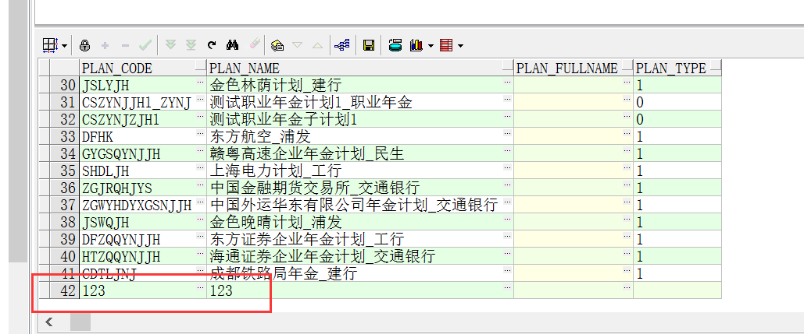
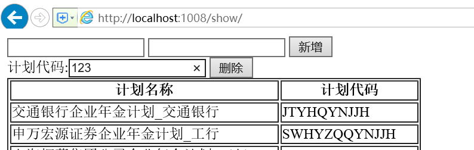
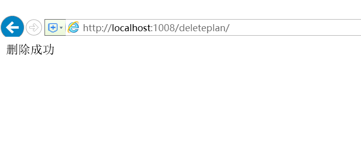

## 一 增删改

#### 1.增加数据

修改show 方法:

```
def show(request):
    from myblog import models
    if request.method=='POST':
        plan_code=request.POST['plan_code']
        plan_name=request.POST['plan_name']
        obj = models.TldTplanInfo(plan_code=plan_code, plan_name=plan_name)
        obj.save()

    plan_list=models.TldTplanInfo.objects.all()
    return render(request,"show.html",{'plan_list':plan_list})
```


修改show.html页面,新增一个form 来提交数据

```
<form action="show/" method="post">
<input name="plan_code" type="text" />
<input name="plan_name" type="text" />
<input type="submit" value="新增" />
</form>
```

url中打开http://localhost:1008/show/show/

录入数据后提交表单，结果浏览器提示403的错误，这个就是django中CSFR(跨站请求伪造)的一种安全验证机制

这篇文章有讲解：http://blog.csdn.net/yisuowushinian/article/details/46137511


所以修改show 方法

```
from django.views.decorators.csrf import csrf_exempt

@csrf_exempt
def show(request):
    from myblog import models
    if request.method=='POST':
        plan_code=request.POST['plan_code']
        plan_name=request.POST['plan_name']
        obj = models.TldTplanInfo(plan_code=plan_code, plan_name=plan_name)
        obj.save()

    plan_list=models.TldTplanInfo.objects.all()
    return render(request,"show.html",{'plan_list':plan_list})
```

然后再次提交 数据就新增到数据库去了




#### 2.删除数据

新增一个deleteplan 方法:

```
@csrf_exempt
def deleteplan(request):
    from myblog import models
    plan_code = request.POST['plan_code']
    models.TldTplanInfo.objects.filter(plan_code=plan_code).delete()

    plan_list = models.TldTplanInfo.objects.all()
    return HttpResponse("删除成功")
```


新增路由:

```
urlpatterns = [
    url(r'^$', views.index, name='index'),
    url(r'^show/', views.show, name='show'),
    url(r'^deleteplan/', views.deleteplan, name='deleteplan'),--手动高亮
]
```


修改show.html  新增一个 用于提交删除的form

```
<form action="/deleteplan/" method="post">
计划代码:<input name="plan_code" type="text" />
<input type="submit" value="删除" />
</form>
```

 打开浏览器:http://localhost:1008/show/




点击 删除后 ，页面跳转到/deleteplan/页面



对应的数据库这条数据 也删除了!!!


#### 3.修改数据


添加一个修改的方法

```
@csrf_exempt
def editplan(request):
    from myblog import models
    plan_code = request.POST['plan_code']
    plan_name = request.POST['plan_name']
    obj = models.TldTplanInfo.objects.get(plan_code=plan_code)
    obj.plan_name = plan_name
    obj.save()

    return HttpResponse("修改成功")
```

然后设置路由，修改html，测试修改没问题