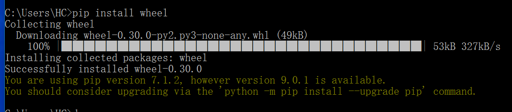
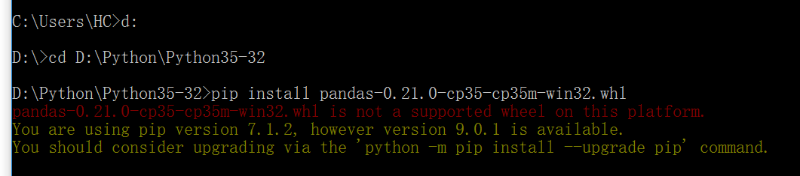
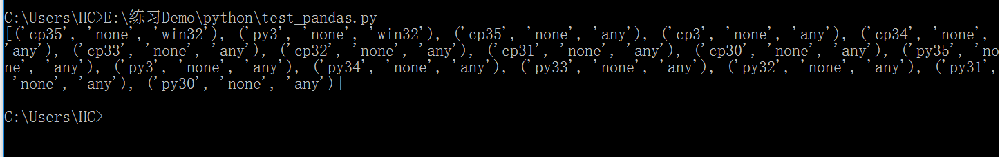
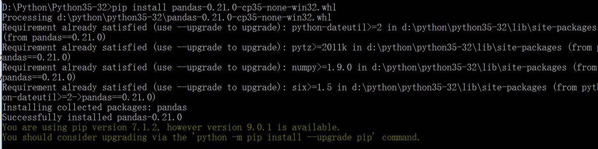

## 安装pandas

windows平台安装pandas会报错“unable to find vcvarsall.bat”，网上很多帖子都说安装vs2010,2012让好设置环境变。这个方法不适合python3.5.

尝试过很多次后 最后还是在https://pypi.python.org/pypi/pandas#downloads 中下载一个pandas的包。我对应的平台下载的是pandas-0.21.0-cp35-cp35m-win32.whl (md5)。

下载的格式是whld ，所以先安装wheel.

cmd:

```
pip install wheel
```




然后cmd 进入存放pandas文件的文件夹下面:

```
d:
cd cd D:\Python\Python35-32
pip install pandas-0.21.0-cp35-cp35m-win32.whl
```

但是 这个时候却报错了:

````
pandas-0.21.0-cp35-cp35m-win32.whl is not a supported wheel on this platform.
````




随便建立一个python文件：

```
import pip;
print(pip.pep425tags.get_supported())
```

这个文件是查看pip支持执行哪些格式的文件。执行这个文件后发现打印的数据每组中间的一个都是"none"

修改文件名为:pandas-0.21.0-cp35-none-win32.whl

再次执行就成功了:

```
pip install pandas-0.21.0-cp35-none-win32.whl
```

